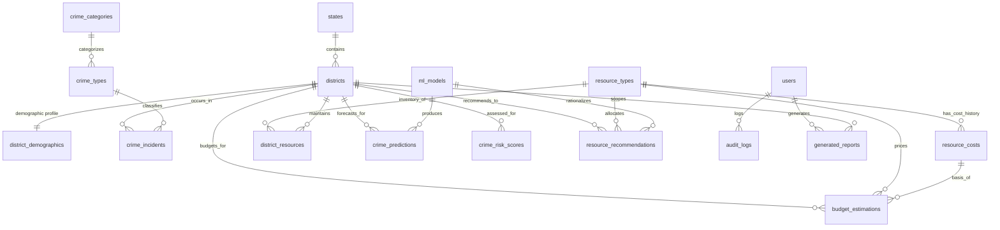

# Phase 2 — Relational Database Design & Architecture (Audited & Frozen)

## 1. System Design Overview

The database design for the **Data-Driven Crime Management System with AI-Based Resource Optimization** adheres to strict Third Normal Form (3NF) principles. It eliminates string duplication, decouples static reference taxonomies from high-frequency transactional incident logs, isolates machine learning metadata, and provides structured support for administrative configurations.

Following the Phase 2 final audit:
- The redundant `cities` table has been removed because an audit verified that `City` is 100% duplicate of `District name` on all 191,679 records.
- Coordinates (`latitude`, `longitude`) are omitted from `districts` because no raw CSV contains coordinates, and web GIS map visualization binds via `district_name` / `census_district_code` to GeoJSON boundaries.
- Unnecessary household counts (`urban_households`, `rural_households`, `total_households`) are eliminated from `district_demographics`.
- The final design consists of **exactly 17 purposeful, normalized tables**.

---

## 2. Entity-Relationship Model (Mermaid Diagram)

---

## 3. Relational Table Specifications (17 Tables)

### Geography & Demographics

#### 1. `states`
- **Purpose**: Authoritative master list of Indian States and Union Territories.
- **Why Required**: Prevents repeating 35 distinct state names as free text across hundreds of thousands of incident records.
- **Primary Key**: `id` INT AUTO_INCREMENT
- **Unique Constraints**: `UNIQUE(state_name)`
- **Columns**:
  - `id`: INT AUTO_INCREMENT PRIMARY KEY
  - `state_name`: VARCHAR(100) NOT NULL UNIQUE
  - `state_code`: VARCHAR(10) NULL
- **Indexes**: `idx_state_name (state_name)`

#### 2. `districts`
- **Purpose**: Administrative district master entities linking state governance to incident logs and demographics.
- **Why Required**: Core planning unit for risk evaluation, ML prediction, and resource dispatching.
- **Primary Key**: `id` INT AUTO_INCREMENT
- **Foreign Keys**: `state_id` REFERENCES `states(id)` ON DELETE RESTRICT
- **Unique Constraints**: `UNIQUE(state_id, district_name)`, `UNIQUE(census_district_code)`
- **Columns**:
  - `id`: INT AUTO_INCREMENT PRIMARY KEY
  - `state_id`: INT NOT NULL
  - `district_name`: VARCHAR(100) NOT NULL
  - `census_district_code`: INT NULL
- **Indexes**: `idx_district_state (state_id)`, `idx_district_name (district_name)`

#### 3. `district_demographics`
- **Purpose**: Census 2011 demographic baseline metrics per district.
- **Why Required**: Required to compute per-capita crime rates (per 100k people), police-to-population ratios, and population exposure risk weights.
- **Primary Key**: `id` INT AUTO_INCREMENT
- **Foreign Keys**: `district_id` REFERENCES `districts(id)` ON DELETE CASCADE
- **Unique Constraints**: `UNIQUE(district_id)`
- **Columns**:
  - `id`: INT AUTO_INCREMENT PRIMARY KEY
  - `district_id`: INT NOT NULL
  - `census_year`: SMALLINT NOT NULL DEFAULT 2011
  - `total_population`: BIGINT NOT NULL
  - `male_population`: BIGINT NOT NULL
  - `female_population`: BIGINT NOT NULL
  - `literate_population`: BIGINT NOT NULL
  - `total_workers`: BIGINT NOT NULL
  - `created_at`: TIMESTAMP DEFAULT CURRENT_TIMESTAMP

---

### Crime Incidents & Classification

#### 4. `crime_categories`
- **Purpose**: High-level classification domains (Violent Crime, Property Crime, Traffic Fatality, Fire Accident).
- **Why Required**: Provides severity multipliers for algorithmic composite risk scores.
- **Primary Key**: `id` INT AUTO_INCREMENT
- **Unique Constraints**: `UNIQUE(category_name)`
- **Columns**:
  - `id`: INT AUTO_INCREMENT PRIMARY KEY
  - `category_name`: VARCHAR(50) NOT NULL UNIQUE
  - `severity_weight`: DECIMAL(3, 2) NOT NULL DEFAULT 1.00 *(Project-defined heuristic based on IPC severity; configurable)*

#### 5. `crime_types`
- **Purpose**: Standardized crime taxonomy and legal sub-types.
- **Why Required**: Enables crime type-specific prediction, category filtering, and severity ranking.
- **Primary Key**: `id` INT AUTO_INCREMENT
- **Foreign Keys**: `category_id` REFERENCES `crime_categories(id)` ON DELETE RESTRICT
- **Unique Constraints**: `UNIQUE(crime_code)`
- **Columns**:
  - `id`: INT AUTO_INCREMENT PRIMARY KEY
  - `category_id`: INT NOT NULL
  - `crime_code`: VARCHAR(20) NOT NULL UNIQUE
  - `crime_name`: VARCHAR(100) NOT NULL
  - `severity_level`: ENUM('LOW', 'MEDIUM', 'HIGH', 'CRITICAL') NOT NULL DEFAULT 'MEDIUM' *(Project-defined ranking; configurable)*
- **Indexes**: `idx_crime_cat (category_id)`

#### 6. `crime_incidents`
- **Purpose**: Clean, deduplicated historical crime incident transaction records.
- **Why Required**: Foundation for all crime analytics, temporal charts, ML training data generation, and risk index calculations.
- **Primary Key**: `id` BIGINT AUTO_INCREMENT
- **Foreign Keys**:
  - `district_id` REFERENCES `districts(id)` ON DELETE RESTRICT
  - `crime_type_id` REFERENCES `crime_types(id)` ON DELETE RESTRICT
- **Unique Constraints**: `UNIQUE(report_number)`
- **Columns**:
  - `id`: BIGINT AUTO_INCREMENT PRIMARY KEY
  - `report_number`: VARCHAR(50) NOT NULL UNIQUE
  - `district_id`: INT NOT NULL
  - `crime_type_id`: INT NOT NULL
  - `incident_date`: DATE NOT NULL
  - `incident_time`: TIME NOT NULL
  - `reported_date`: DATE NOT NULL
  - `victim_age`: SMALLINT NULL
  - `victim_gender`: ENUM('M', 'F', 'OTHER', 'UNKNOWN') NOT NULL DEFAULT 'UNKNOWN'
  - `weapon_used`: VARCHAR(50) NULL *(Preserves NULL for unknown/unrecorded; distinct from 'NONE' or 'OTHER')*
  - `police_deployed_count`: SMALLINT NOT NULL DEFAULT 0 *(Historical single-incident response presence)*
  - `case_status`: ENUM('OPEN', 'CLOSED') NOT NULL DEFAULT 'OPEN'
  - `closed_date`: DATE NULL
  - `created_at`: TIMESTAMP DEFAULT CURRENT_TIMESTAMP
- **Indexes**:
  - `idx_incident_district_date (district_id, incident_date)`
  - `idx_incident_type_date (crime_type_id, incident_date)`
  - `idx_incident_date (incident_date)`

---

### Police Resource & Cost Management

#### 7. `resource_types`
- **Purpose**: Master catalog of deployable police operational resources.
- **Why Required**: Defines valid equipment and personnel categories dynamically without hardcoding.
- **Primary Key**: `id` INT AUTO_INCREMENT
- **Unique Constraints**: `UNIQUE(resource_name)`
- **Columns**:
  - `id`: INT AUTO_INCREMENT PRIMARY KEY
  - `resource_name`: VARCHAR(100) NOT NULL UNIQUE
  - `unit_of_measure`: VARCHAR(30) NOT NULL
  - `description`: TEXT NULL
  - `is_active`: BOOLEAN NOT NULL DEFAULT TRUE

#### 8. `resource_costs`
- **Purpose**: Configurable unit cost schedules for police resources over time.
- **Why Required**: Decouples financial calculations from application code so costs are never hardcoded in Python.
- **Primary Key**: `id` INT AUTO_INCREMENT
- **Foreign Keys**: `resource_type_id` REFERENCES `resource_types(id)` ON DELETE RESTRICT
- **Columns**:
  - `id`: INT AUTO_INCREMENT PRIMARY KEY
  - `resource_type_id`: INT NOT NULL
  - `unit_cost`: DECIMAL(12, 2) NOT NULL
  - `effective_from`: DATE NOT NULL
  - `effective_to`: DATE NULL
  - `is_active`: BOOLEAN NOT NULL DEFAULT TRUE
  - `created_at`: TIMESTAMP DEFAULT CURRENT_TIMESTAMP
- **Indexes**: `idx_cost_resource_active (resource_type_id, is_active)`

#### 9. `district_resources`
- **Purpose**: Current available resource inventory per district and planning period.
- **Why Required**: Represents active district station inventory configured by administrators (completely distinct from `police_deployed_count`).
- **Primary Key**: `id` INT AUTO_INCREMENT
- **Foreign Keys**:
  - `district_id` REFERENCES `districts(id)` ON DELETE RESTRICT
  - `resource_type_id` REFERENCES `resource_types(id)` ON DELETE RESTRICT
- **Unique Constraints**: `UNIQUE(district_id, resource_type_id, period_year, period_month)`
- **Columns**:
  - `id`: INT AUTO_INCREMENT PRIMARY KEY
  - `district_id`: INT NOT NULL
  - `resource_type_id`: INT NOT NULL
  - `available_quantity`: INT NOT NULL DEFAULT 0
  - `period_year`: SMALLINT NOT NULL
  - `period_month`: SMALLINT NOT NULL
  - `updated_at`: TIMESTAMP DEFAULT CURRENT_TIMESTAMP ON UPDATE CURRENT_TIMESTAMP

---

### Machine Learning, Prediction & Risk Scoring

#### 10. `ml_models`
- **Purpose**: Centralized registry tracking trained machine learning models, versions, and validation metrics.
- **Why Required**: Tracks model lineage, performance (MAE, RMSE, R2), and active deployment status.
- **Primary Key**: `id` INT AUTO_INCREMENT
- **Unique Constraints**: `UNIQUE(model_name, version)`
- **Columns**:
  - `id`: INT AUTO_INCREMENT PRIMARY KEY
  - `model_name`: VARCHAR(100) NOT NULL
  - `model_type`: VARCHAR(50) NOT NULL
  - `version`: VARCHAR(20) NOT NULL
  - `algorithm`: VARCHAR(100) NOT NULL
  - `evaluation_metrics`: JSON NOT NULL
  - `training_date`: DATETIME NOT NULL
  - `dataset_snapshot`: VARCHAR(100) NOT NULL
  - `artifact_path`: VARCHAR(255) NOT NULL
  - `is_active`: BOOLEAN NOT NULL DEFAULT FALSE
  - `created_at`: TIMESTAMP DEFAULT CURRENT_TIMESTAMP

#### 11. `crime_predictions`
- **Purpose**: Stores future crime forecasts generated by trained machine learning models.
- **Why Required**: Decouples offline ML inference execution from low-latency dashboard queries.
- **Primary Key**: `id` BIGINT AUTO_INCREMENT
- **Foreign Keys**:
  - `district_id` REFERENCES `districts(id)` ON DELETE RESTRICT
  - `crime_type_id` REFERENCES `crime_types(id)` ON DELETE SET NULL
  - `model_id` REFERENCES `ml_models(id)` ON DELETE RESTRICT
- **Columns**:
  - `id`: BIGINT AUTO_INCREMENT PRIMARY KEY
  - `district_id`: INT NOT NULL
  - `crime_type_id`: INT NULL
  - `model_id`: INT NOT NULL
  - `prediction_date`: DATE NOT NULL
  - `predicted_crime_count`: DECIMAL(10, 2) NOT NULL
  - `confidence_lower`: DECIMAL(10, 2) NULL
  - `confidence_upper`: DECIMAL(10, 2) NULL
  - `generated_at`: TIMESTAMP DEFAULT CURRENT_TIMESTAMP
- **Indexes**: `idx_pred_dist_date (district_id, prediction_date)`

#### 12. `crime_risk_scores`
- **Purpose**: Stores multidimensional composite risk scores for each district and period.
- **Why Required**: Powers crime-prone hotspot detection, risk maps, and executive dashboards without repeating dynamic calculations.
- **Primary Key**: `id` BIGINT AUTO_INCREMENT
- **Foreign Keys**: `district_id` REFERENCES `districts(id)` ON DELETE RESTRICT
- **Unique Constraints**: `UNIQUE(district_id, period_year, period_month)`
- **Columns**:
  - `id`: BIGINT AUTO_INCREMENT PRIMARY KEY
  - `district_id`: INT NOT NULL
  - `period_year`: SMALLINT NOT NULL
  - `period_month`: SMALLINT NOT NULL
  - `overall_risk_score`: DECIMAL(5, 2) NOT NULL
  - `risk_level`: ENUM('LOW', 'MODERATE', 'HIGH', 'CRITICAL') NOT NULL
  - `severity_index`: DECIMAL(5, 2) NOT NULL
  - `trend_index`: DECIMAL(5, 2) NOT NULL
  - `volume_index`: DECIMAL(5, 2) NOT NULL
  - `population_density_factor`: DECIMAL(5, 2) NOT NULL
  - `calculation_version`: VARCHAR(20) NOT NULL DEFAULT 'v1.0'
  - `generated_at`: TIMESTAMP DEFAULT CURRENT_TIMESTAMP
- **Indexes**: `idx_risk_period (period_year, period_month, overall_risk_score)`

---

### Decision Support: Recommendations & Budget

#### 13. `resource_recommendations`
- **Purpose**: Preserves optimization engine recommendations for patrol personnel and equipment.
- **Why Required**: Directly delivers resource optimization recommendations and shortfall calculations with explainable rationale.
- **Primary Key**: `id` BIGINT AUTO_INCREMENT
- **Foreign Keys**:
  - `district_id` REFERENCES `districts(id)` ON DELETE RESTRICT
  - `resource_type_id` REFERENCES `resource_types(id)` ON DELETE RESTRICT
  - `model_id` REFERENCES `ml_models(id)` ON DELETE SET NULL
- **Unique Constraints**: `UNIQUE(district_id, resource_type_id, period_year, period_month)`
- **Columns**:
  - `id`: BIGINT AUTO_INCREMENT PRIMARY KEY
  - `district_id`: INT NOT NULL
  - `resource_type_id`: INT NOT NULL
  - `period_year`: SMALLINT NOT NULL
  - `period_month`: SMALLINT NOT NULL
  - `available_quantity`: INT NOT NULL
  - `recommended_quantity`: INT NOT NULL
  - `shortfall_quantity`: INT NOT NULL
  - `optimization_rationale`: TEXT NULL
  - `model_id`: INT NULL
  - `generated_at`: TIMESTAMP DEFAULT CURRENT_TIMESTAMP
- **Indexes**: `idx_recom_period (district_id, period_year, period_month)`

#### 14. `budget_estimations`
- **Purpose**: Stores estimated operational costs required to fulfill resource recommendations.
- **Why Required**: Provides department leadership with precise fiscal budget projections.
- **Primary Key**: `id` BIGINT AUTO_INCREMENT
- **Foreign Keys**:
  - `district_id` REFERENCES `districts(id)` ON DELETE RESTRICT
  - `resource_type_id` REFERENCES `resource_types(id)` ON DELETE RESTRICT
  - `cost_config_id` REFERENCES `resource_costs(id)` ON DELETE RESTRICT
- **Unique Constraints**: `UNIQUE(district_id, resource_type_id, period_year, period_month)`
- **Columns**:
  - `id`: BIGINT AUTO_INCREMENT PRIMARY KEY
  - `district_id`: INT NOT NULL
  - `resource_type_id`: INT NOT NULL
  - `period_year`: SMALLINT NOT NULL
  - `period_month`: SMALLINT NOT NULL
  - `recommended_units`: INT NOT NULL
  - `unit_cost`: DECIMAL(12, 2) NOT NULL
  - `estimated_total_cost`: DECIMAL(14, 2) NOT NULL
  - `currency`: VARCHAR(10) NOT NULL DEFAULT 'INR'
  - `cost_config_id`: INT NOT NULL
  - `generated_at`: TIMESTAMP DEFAULT CURRENT_TIMESTAMP

---

### Security, Audit & Reporting

#### 15. `users`
- **Purpose**: System credentials, authorization profiles, and access control.
- **Why Required**: Supports JWT authentication, login sessions, and role-based permissions (ADMIN, ANALYST, OFFICER).
- **Primary Key**: `id` INT AUTO_INCREMENT
- **Unique Constraints**: `UNIQUE(username)`, `UNIQUE(email)`
- **Columns**:
  - `id`: INT AUTO_INCREMENT PRIMARY KEY
  - `username`: VARCHAR(50) NOT NULL UNIQUE
  - `email`: VARCHAR(100) NOT NULL UNIQUE
  - `password_hash`: VARCHAR(255) NOT NULL
  - `full_name`: VARCHAR(100) NOT NULL
  - `role`: ENUM('ADMIN', 'ANALYST', 'OFFICER') NOT NULL DEFAULT 'ANALYST'
  - `is_active`: BOOLEAN NOT NULL DEFAULT TRUE
  - `last_login_at`: DATETIME NULL
  - `created_at`: TIMESTAMP DEFAULT CURRENT_TIMESTAMP
  - `updated_at`: TIMESTAMP DEFAULT CURRENT_TIMESTAMP ON UPDATE CURRENT_TIMESTAMP

#### 16. `audit_logs`
- **Purpose**: Immutable activity log recording high-impact administrative actions.
- **Why Required**: Provides auditability for cost adjustments, user alterations, and model deployments.
- **Primary Key**: `id` BIGINT AUTO_INCREMENT
- **Foreign Keys**: `user_id` REFERENCES `users(id)` ON DELETE SET NULL
- **Columns**:
  - `id`: BIGINT AUTO_INCREMENT PRIMARY KEY
  - `user_id`: INT NULL
  - `action`: VARCHAR(50) NOT NULL
  - `entity_type`: VARCHAR(50) NOT NULL
  - `entity_id`: VARCHAR(50) NULL
  - `details`: JSON NULL
  - `ip_address`: VARCHAR(45) NULL
  - `created_at`: TIMESTAMP DEFAULT CURRENT_TIMESTAMP
- **Indexes**: `idx_audit_user_date (user_id, created_at)`

#### 17. `generated_reports`
- **Purpose**: Archival metadata for generated PDF intelligence and budget reports.
- **Why Required**: Allows historical retrieval, audit tracking, and download management for generated reports.
- **Primary Key**: `id` INT AUTO_INCREMENT
- **Foreign Keys**:
  - `generated_by_user_id` REFERENCES `users(id)` ON DELETE RESTRICT
  - `district_id` REFERENCES `districts(id)` ON DELETE SET NULL
- **Columns**:
  - `id`: INT AUTO_INCREMENT PRIMARY KEY
  - `report_title`: VARCHAR(150) NOT NULL
  - `report_type`: ENUM('DISTRICT_INTELLIGENCE', 'RESOURCE_OPTIMIZATION', 'BUDGET_ESTIMATION', 'EXECUTIVE_SUMMARY') NOT NULL
  - `generated_by_user_id`: INT NOT NULL
  - `district_id`: INT NULL
  - `period_year`: SMALLINT NOT NULL
  - `period_month`: SMALLINT NULL
  - `file_path`: VARCHAR(255) NOT NULL
  - `file_size_bytes`: INT NOT NULL
  - `generated_at`: TIMESTAMP DEFAULT CURRENT_TIMESTAMP
- **Indexes**: `idx_report_type_period (report_type, period_year, period_month)`

---

## 4. Normalization Analysis

- **1NF (First Normal Form)**: All attributes are atomic. Repeating groups (unformatted dates, composite location strings) are normalized.
- **2NF (Second Normal Form)**: All non-key attributes are fully functionally dependent on surrogate primary keys (`id`). Composite natural keys are enforced through unique constraints.
- **3NF (Third Normal Form)**: All transitive dependencies are eliminated. States, districts, crime categories, and resource costs are isolated in dedicated master tables.

---

## 5. Storage Volume Projections (Audited)

| Table Name | Retained Records | Estimated Size |
|---|---|---|
| `states` | 35 | ~4 KB |
| `districts` | 634 | ~76 KB |
| `district_demographics` | 634 | ~70 KB |
| `crime_categories` | 4 | < 1 KB |
| `crime_types` | 21 | ~2 KB |
| `crime_incidents` | 191,679 | ~32.5 MB |
| `resource_types` | 4 | < 1 KB |
| `resource_costs` | ~16 | ~1 KB |
| `district_resources` | ~7,608 | ~450 KB |
| `ml_models` | ~10 | ~5 KB |
| `crime_predictions` | ~30,432 | ~2.7 MB |
| `crime_risk_scores` | ~7,608 | ~830 KB |
| `resource_recommendations` | ~30,432 | ~4.2 MB |
| `budget_estimations` | ~30,432 | ~3.0 MB |
| `users` | ~10 | ~2.5 KB |
| `audit_logs` | ~5,000 | ~1.5 MB |
| `generated_reports` | ~500 | ~100 KB |
| **Total Footprint** | **~298,400 rows** | **~45.4 MB** |
