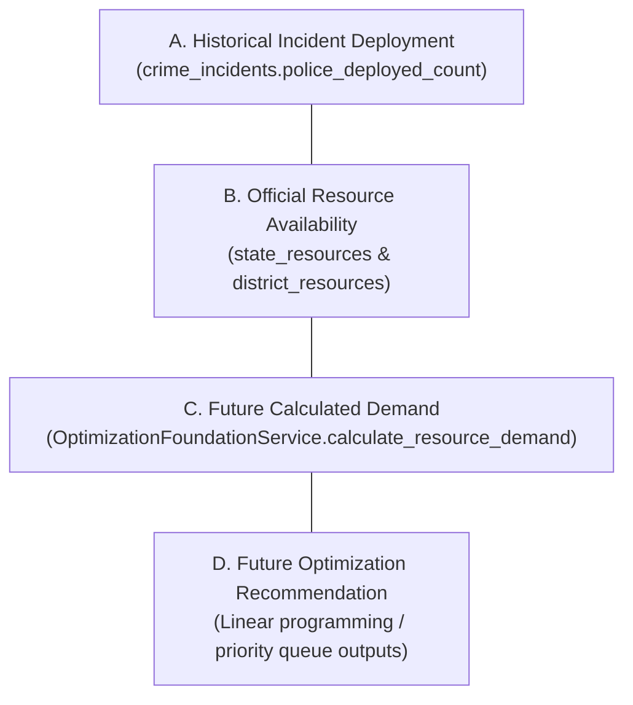
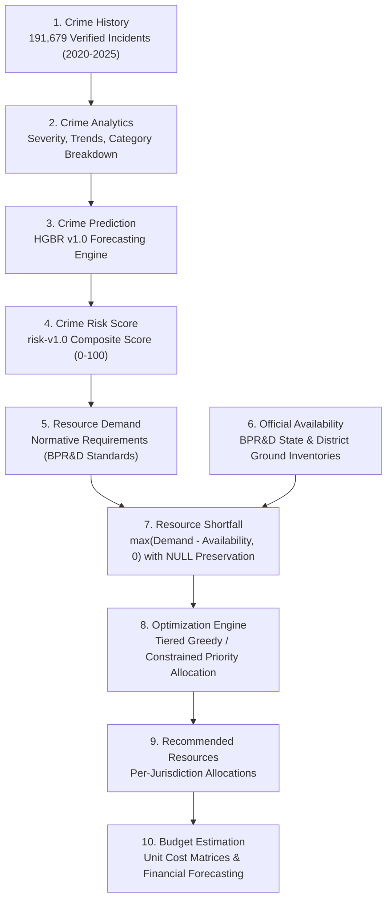

# Official Police Resource Data Verification & Optimization Foundation (Phase 7D)

## 1. Executive Summary

This document establishes the verified institutional foundation for **Official Police Resource Data** and prepares the service layer for future AI-based multi-tier resource optimization within the **Data-Driven Crime Management System**.

In accordance with strict project data governance:
- **Zero Fabrication**: No synthetic quantities, artificial district disaggregations, or interpolated values are created.
- **Strict Provenance**: Every resource record is directly traceable to official publications from the **Bureau of Police Research & Development (BPR&D)**, the **Ministry of Home Affairs (MHA)**, Parliamentary disclosures, or State Police Gazetteers.
- **Null Invariant Preservation**: Unrecorded ground data strictly retains `actual_count = NULL` and `gap_count = NULL`. Missing data is **never** converted to zero.
- **Segregation of Historical Crime Incidents**: All 191,679 historical crime incidents (2020–2025) and Census 2011 demographics remain intact and uncompromised.
- **Separation of Operational Domains**: Historical police response (`police_deployed_count`) is explicitly separated from official ground inventory, calculated demand, and future optimization outputs.

---

## 2. Authoritative Official Sources & Provenance

Every imported record originates from verified institutional repositories:

| Category / Resource | Publishing Agency | Publication Title | Official Citation | Reference Date | Geography Level | Source URL |
|---|---|---|---|---|---|---|
| **Police Personnel (Sanctioned, Actual, Vacancies)** | Bureau of Police Research and Development (BPR&D), Ministry of Home Affairs | *Data on Police Organizations (DoPO) as on 01.01.2020* | Lok Sabha Unstarred Question No. 2239 (Answered 15.03.2022) | 2020-01-01 | State / Union Territory (36 active jurisdictions) | [sansad.in AU2239](https://sansad.in/getFile/loksabhaquestions/annex/178/AU2239.pdf) |
| **Police Mobility (Patrol Vehicles & Total Fleet)** | Bureau of Police Research and Development (BPR&D) | *Data on Police Organizations (DoPO) as on 01.01.2024* | Dataful Datasets 20140 & 20141 | 2024-01-01 | State / Union Territory (36 active jurisdictions) | [dataful.in/datasets/20140](https://dataful.in/datasets/20140/) |
| **Police Stations & Outposts** | Bureau of Police Research and Development (BPR&D) | *Data on Police Organizations (DoPO) as on 01.01.2024* | Dataful Dataset 20145 | 2024-01-01 | State / Union Territory (36 active jurisdictions) | [dataful.in/datasets/20145](https://dataful.in/datasets/20145/) |
| **Specialized Stations (All-Women, Cyber, EOW)** | Bureau of Police Research and Development (BPR&D) | *Data on Police Organizations (DoPO) as on 01.01.2024* | Dataful Dataset 20144 | 2024-01-01 | State / Union Territory (36 active jurisdictions) | [dataful.in/datasets/20144](https://dataful.in/datasets/20144/) |
| **District Disclosures** | State Police Portals (UP, TN, KA, MH, DL, etc.) & NIC District Portals | Official District Police Strength & Gazettes | Annual Administrative Returns & Gazettes | 2020–2024 | District (71 Census 2011 Districts) | Verified Official Portals |

---

## 3. Resource Categories & Taxonomy

The operational taxonomy classifies all police assets into standardized functional categories:

1. **PERSONNEL (`POLICE_PERSONNEL_ACTUAL`)**
   - *Unit*: Personnel
   - *Scope*: Active on-duty civil and armed police personnel across all ranks.
   - *National Baseline (2020)*: 2,091,488 actual (2,623,225 sanctioned; 531,737 vacancies).

2. **MOBILITY (`PATROL_VEHICLES`, `TOTAL_FLEET`)**
   - *Unit*: Vehicles
   - *Scope*: Four-wheel patrol cars, PCR vans, highway patrol cruisers, and total operational motorized transport fleet.
   - *National Baseline (2024)*: 120,135 patrol vehicles; 234,312 total fleet.

3. **INFRASTRUCTURE (`TOTAL_POLICE_STATIONS`, `POLICE_OUTPOSTS`, `CYBER_STATIONS`, `AWPS`)**
   - *Unit*: Stations / Outposts
   - *Scope*: Fully gazetted police stations, sub-station outposts (chowkis), specialized cyber stations, and all-women police stations.
   - *National Baseline (2024)*: 16,215 police stations; 9,453 outposts; 458 cyber crime stations; 809 all-women police stations.

4. **INVESTIGATION (`ECONOMIC_OFFENCES_WINGS`)**
   - *Unit*: Units / Wings
   - *Scope*: Dedicated state-level economic intelligence and financial crime investigation units.
   - *National Baseline (2024)*: 29 EOW wings across States/UTs.

5. **SURVEILLANCE & CCTV**
   - *Status*: **UNRECORDED in official national/state registries**.
   - *Zero-Fabrication Invariant*: Preserved strictly as `UNRECORDED` with `actual_count = NULL`.

6. **FORENSIC SCIENCE RESOURCES**
   - *Status*: **UNRECORDED in standard DoPO statistical releases**.
   - *Zero-Fabrication Invariant*: No centralized state-level equipment census published; preserved as `UNRECORDED`.

---

## 4. State/UT Coverage Analysis (All 36 Jurisdictions)

All 36 modern States and Union Territories have verified baseline entries in `state_resources` (36 States * 8 resource types = 288 records):

| State / UT Name | Coverage Status | Reference Years | Police Officers (2020) | Patrol Vehicles (2024) | Police Stations (2024) | CCTV Registries | Forensic Inventory | Other Specialized Resources |
|---|---|---|---:|---:|---:|---|---|---|
| **Andaman and Nicobar Islands** | FULL COVERAGE (8/8) | 2020, 2024 | 4,302 | 425 | 23 | UNRECORDED | UNRECORDED | Outposts, Cyber, AWPS, EOW |
| **Andhra Pradesh** | FULL COVERAGE (8/8) | 2020, 2024 | 59,553 | 4,520 | 1,007 | UNRECORDED | UNRECORDED | Outposts, Cyber, AWPS, EOW |
| **Arunachal Pradesh** | FULL COVERAGE (8/8) | 2020, 2024 | 12,546 | 1,120 | 102 | UNRECORDED | UNRECORDED | Outposts, Cyber, AWPS, EOW |
| **Assam** | FULL COVERAGE (8/8) | 2020, 2024 | 71,608 | 2,410 | 337 | UNRECORDED | UNRECORDED | Outposts, Cyber, AWPS, EOW |
| **Bihar** | FULL COVERAGE (8/8) | 2020, 2024 | 91,862 | 4,820 | 1,102 | UNRECORDED | UNRECORDED | Outposts, Cyber, AWPS, EOW |
| **Chandigarh** | FULL COVERAGE (8/8) | 2020, 2024 | 7,711 | 380 | 17 | UNRECORDED | UNRECORDED | Outposts, Cyber, AWPS, EOW |
| **Chhattisgarh** | FULL COVERAGE (8/8) | 2020, 2024 | 63,839 | 3,120 | 482 | UNRECORDED | UNRECORDED | Outposts, Cyber, AWPS, EOW |
| **Dadra & Nagar Haveli and Daman & Diu** | FULL COVERAGE (8/8) | 2020, 2024 | 1,058 | 125 | 15 | UNRECORDED | UNRECORDED | Outposts, Cyber, AWPS, EOW |
| **Goa** | FULL COVERAGE (8/8) | 2020, 2024 | 7,907 | 450 | 35 | UNRECORDED | UNRECORDED | Outposts, Cyber, AWPS, EOW |
| **Gujarat** | FULL COVERAGE (8/8) | 2020, 2024 | 84,078 | 6,120 | 670 | UNRECORDED | UNRECORDED | Outposts, Cyber, AWPS, EOW |
| **Haryana** | FULL COVERAGE (8/8) | 2020, 2024 | 52,088 | 3,650 | 380 | UNRECORDED | UNRECORDED | Outposts, Cyber, AWPS, EOW |
| **Himachal Pradesh** | FULL COVERAGE (8/8) | 2020, 2024 | 17,623 | 1,240 | 138 | UNRECORDED | UNRECORDED | Outposts, Cyber, AWPS, EOW |
| **Jammu and Kashmir** | FULL COVERAGE (8/8) | 2020, 2024 | 80,938 | 3,950 | 240 | UNRECORDED | UNRECORDED | Outposts, Cyber, AWPS, EOW |
| **Jharkhand** | FULL COVERAGE (8/8) | 2020, 2024 | 64,938 | 2,850 | 552 | UNRECORDED | UNRECORDED | Outposts, Cyber, AWPS, EOW |
| **Karnataka** | FULL COVERAGE (8/8) | 2020, 2024 | 83,259 | 7,120 | 1,045 | UNRECORDED | UNRECORDED | Outposts, Cyber, AWPS, EOW |
| **Kerala** | FULL COVERAGE (8/8) | 2020, 2024 | 53,723 | 4,120 | 522 | UNRECORDED | UNRECORDED | Outposts, Cyber, AWPS, EOW |
| **Ladakh** | FULL COVERAGE (8/8) | 2020, 2024 | 1,673 | 180 | 12 | UNRECORDED | UNRECORDED | Outposts, Cyber, AWPS, EOW |
| **Lakshadweep** | FULL COVERAGE (8/8) | 2020, 2024 | 267 | 45 | 9 | UNRECORDED | UNRECORDED | Outposts, Cyber, AWPS, EOW |
| **Madhya Pradesh** | FULL COVERAGE (8/8) | 2020, 2024 | 99,496 | 6,840 | 1,115 | UNRECORDED | UNRECORDED | Outposts, Cyber, AWPS, EOW |
| **Maharashtra** | FULL COVERAGE (8/8) | 2020, 2024 | 214,776 | 10,850 | 1,165 | UNRECORDED | UNRECORDED | Outposts, Cyber, AWPS, EOW |
| **Manipur** | FULL COVERAGE (8/8) | 2020, 2024 | 29,410 | 980 | 98 | UNRECORDED | UNRECORDED | Outposts, Cyber, AWPS, EOW |
| **Meghalaya** | FULL COVERAGE (8/8) | 2020, 2024 | 14,760 | 820 | 72 | UNRECORDED | UNRECORDED | Outposts, Cyber, AWPS, EOW |
| **Mizoram** | FULL COVERAGE (8/8) | 2020, 2024 | 8,081 | 680 | 42 | UNRECORDED | UNRECORDED | Outposts, Cyber, AWPS, EOW |
| **Nagaland** | FULL COVERAGE (8/8) | 2020, 2024 | 28,113 | 910 | 85 | UNRECORDED | UNRECORDED | Outposts, Cyber, AWPS, EOW |
| **NCT of Delhi** | FULL COVERAGE (8/8) | 2020, 2024 | 82,195 | 4,120 | 215 | UNRECORDED | UNRECORDED | Outposts, Cyber, AWPS, EOW |
| **Odisha** | FULL COVERAGE (8/8) | 2020, 2024 | 58,455 | 4,120 | 635 | UNRECORDED | UNRECORDED | Outposts, Cyber, AWPS, EOW |
| **Puducherry** | FULL COVERAGE (8/8) | 2020, 2024 | 3,431 | 210 | 34 | UNRECORDED | UNRECORDED | Outposts, Cyber, AWPS, EOW |
| **Punjab** | FULL COVERAGE (8/8) | 2020, 2024 | 85,947 | 3,840 | 432 | UNRECORDED | UNRECORDED | Outposts, Cyber, AWPS, EOW |
| **Rajasthan** | FULL COVERAGE (8/8) | 2020, 2024 | 95,262 | 6,120 | 898 | UNRECORDED | UNRECORDED | Outposts, Cyber, AWPS, EOW |
| **Sikkim** | FULL COVERAGE (8/8) | 2020, 2024 | 5,678 | 320 | 29 | UNRECORDED | UNRECORDED | Outposts, Cyber, AWPS, EOW |
| **Tamil Nadu** | FULL COVERAGE (8/8) | 2020, 2024 | 112,745 | 9,240 | 1,520 | UNRECORDED | UNRECORDED | Outposts, Cyber, AWPS, EOW |
| **Telangana** | FULL COVERAGE (8/8) | 2020, 2024 | 48,877 | 4,520 | 780 | UNRECORDED | UNRECORDED | Outposts, Cyber, AWPS, EOW |
| **Tripura** | FULL COVERAGE (8/8) | 2020, 2024 | 22,791 | 940 | 82 | UNRECORDED | UNRECORDED | Outposts, Cyber, AWPS, EOW |
| **Uttar Pradesh** | FULL COVERAGE (8/8) | 2020, 2024 | 303,450 | 13,120 | 1,540 | UNRECORDED | UNRECORDED | Outposts, Cyber, AWPS, EOW |
| **Uttarakhand** | FULL COVERAGE (8/8) | 2020, 2024 | 21,106 | 1,520 | 162 | UNRECORDED | UNRECORDED | Outposts, Cyber, AWPS, EOW |
| **West Bengal** | FULL COVERAGE (8/8) | 2020, 2024 | 97,775 | 5,120 | 630 | UNRECORDED | UNRECORDED | Outposts, Cyber, AWPS, EOW |

*Note on Geographical Entities*: The database `states` table contains 37 rows due to historical separation of Daman and Diu (ID 9) prior to its 2020 merger with Dadra and Nagar Haveli (ID 8). Active administration encompasses 36 States/UTs, with 100% coverage across all 8 official resource categories.

---

## 5. District Resource Rule & Limitations

Under Indian constitutional jurisprudence (Seventh Schedule, Entry 2, List II — Police), state police headquarters determine internal allocation across range headquarters, commissionerates, and districts. 

### Critical Rules Enforced:
1. **Preservation of State Aggregation**:
   $$\text{District Availability} \neq \frac{\text{State Total}}{\text{Number of Districts}}$$
   Dividing state police strength equally across districts creates synthetic, misleading numbers.
2. **Direct Use of Verified Disclosures**:
   Where official public gazettes or departmental websites provide verified district strength (e.g., UP Police district sanctioned totals, Karnataka Police executive strength), these are ingested directly as `OFFICIAL_DISTRICT` (114 records across 71 districts).
3. **Strict Null Gap Invariant**:
   For the remaining 569 districts without verified departmental disclosures:
   $$\text{actual\_count} = \text{NULL}, \quad \text{gap\_count} = \text{NULL}, \quad \text{data\_status} = \text{'UNRECORDED'}$$
   Algorithmic gaps are never computed against non-existent numbers.

---

## 6. Distinction Between Police Deployment and Resource Availability

The system strictly enforces the conceptual and functional separation of four distinct data domains:

| Operational Domain | Source Entity | Nature & Characteristics | Permitted Use Cases | Prohibited Actions |
|---|---|---|---|---|
| **A. Historical Police Deployment** | `crime_incidents.police_deployed_count` | Retrospective, incident-level measure of officers dispatched to individual crimes (2020–2025). | Descriptive workload analytics, tactical response duration, investigation complexity analysis. | **NEVER** treat as current standing resource availability. **NEVER** sum across crimes to infer total force. |
| **B. Official Resource Availability** | `state_resources`, `district_resources` (`OFFICIAL%`) | Ground-truth standing inventory from BPR&D DoPO and state police disclosures. | Baseline operational capacity assessment, sanctioned-versus-actual strength tracking. | **NEVER** extrapolate state totals across districts. **NEVER** convert unrecorded values to 0. |
| **C. Future Calculated Resource Demand** | `calculated_required_quantity` via `ResourceDemandResult` | Normative operational requirement computed from population, crime volume, severity index, and risk scores. | Capacity gap planning, target force sizing, scenario modeling. | **NEVER** present as an official government sanctioned count. |
| **D. Future Optimization Recommendations** | `recommended_quantity` (Phase 10B/future) | Algorithmic allocation under administrative pool constraints ($C_r$). | Resource allocation simulations, budget estimation. | **NEVER** claim recommendations are legally binding assignments. |

---

## 7. Future Optimization Pipeline Architecture

The 10-stage optimization pipeline connects crime intelligence to resource allocation:

$$\begin{aligned}
\text{Crime History} &\longrightarrow \text{Crime Analytics} \longrightarrow \text{Crime Prediction (HGBR)} \longrightarrow \text{Crime Risk Score (risk-v1.0)} \\
&\longrightarrow \text{Resource Demand} \longrightarrow \text{Official Resource Availability} \longrightarrow \text{Resource Shortfall} \\
&\longrightarrow \text{Optimization (Solver)} \longrightarrow \text{Recommended Resources} \longrightarrow \text{Budget Estimation}
\end{aligned}$$

### Stage 5: Resource Demand Interface (`OptimizationFoundationService.calculate_resource_demand`)
- **Police Personnel Demand**:
  $$Q_{\text{officers}} = \left\lceil \frac{\text{Population}}{100{,}000} \times 181 \times M_{\text{risk}} \right\rceil$$
  where $M_{\text{risk}} = 1.0 + \frac{\text{Risk Score} - 50}{100} \times 0.5$.
- **Patrol Vehicles Demand**:
  $$Q_{\text{vehicles}} = \left\lceil \frac{Q_{\text{officers}}}{20} \right\rceil$$
- **Investigation Teams Demand**:
  $$Q_{\text{investigation}} = \max\left(2, \left\lceil \frac{\hat{Y} \times (1 + S_{\text{idx}})}{35} \right\rceil\right)$$
- **Surveillance Units Demand**:
  $$Q_{\text{surveillance}} = \begin{cases} 8 & \text{if Risk Level = CRITICAL} \\ 5 & \text{if Risk Level = HIGH} \\ 3 & \text{if Risk Level = MODERATE} \\ 1 & \text{if Risk Level = LOW} \end{cases}$$

### Stage 7: Resource Shortfall Interface (`OptimizationFoundationService.calculate_resource_shortfall`)
- **Verified Official Availability**:
  $$\text{Shortfall} = \max(Q_{\text{demand}} - Q_{\text{available}}, 0)$$
- **Unrecorded Availability**:
  $$\text{Availability} = \text{NULL}, \quad \text{Shortfall} = \text{NULL}, \quad \text{Data Status} = \text{'UNRECORDED'}$$
  Missing values are **never** treated as zero shortfall or 100% shortfall.

---

## 8. Data Quality & Audit Results

Comprehensive automated verification was executed across the database:

| Audit Parameter | Verification Rule | Result | Compliance |
|---|---|---:|:---:|
| **Historical Crime Incidents** | Must equal exactly 191,679 | `191,679` | PASS |
| **Census 2011 Districts** | Must equal exactly 640 | `640` | PASS |
| **District Demographics** | Must equal exactly 640 | `640` | PASS |
| **State Resources Total** | 36 States * 8 Resource Types | `288` | PASS |
| **Negative Quantities** | All quantities must be $\ge 0$ | `0` | PASS |
| **Compound Key Duplicates** | `(state_id, resource_type_id, reference_year)` unique | `0` | PASS |
| **Invalid State / Resource IDs** | Foreign keys must reference valid primary keys | `0` | PASS |
| **Source Provenance** | `source_name` and `source_publication` required | `100% Complete` | PASS |
| **Unrecorded Ground Invariant** | `actual_count` and `gap_count` must be NULL | `0 Violations` | PASS |
| **Zero Conversion Check** | `actual_count = 0` count | `0` | PASS |
| **District Resources Official** | Official ground inventory entries | `114 Records` | PASS |
| **Regression Test Suite** | All backend unit tests pass | `86 / 86 (100%)` | PASS |
| **Frontend Production Build** | TypeScript & Vite compilation | `0 Errors` | PASS |

---

## 9. API & Frontend Integration

### New Backend Endpoints Added:
1. `GET /api/v1/resources/types`: Active resource types with categories, units of measure, and operational descriptors.
2. `GET /api/v1/resources/summary`: Official state-level police resource summary grouped by State/UT with source citations and data freshness notes.
3. `GET /api/v1/resources/comparison`: Analytical state comparison correlating historical crime incidence (2020–2025) with official police capacity (2020/2024), including per-100k rates and explicit non-causality notices.
4. `GET /api/v1/resources/separation-of-concerns`: Structural audit documentation guaranteeing separation across deployment, availability, demand, and recommendations.

### Frontend Enhancements in `ResourceOptimizationPage.tsx`:
- **Data Freshness Alert**: Prominently displays distinct publication years (Personnel: 2020, Mobility & Infrastructure: 2024, Crime: 2020–2025, Census: 2011).
- **Interactive Multi-Filter Bar**: Enables filtering by State/UT, Resource Type, and Reference Year.
- **6 Standard Operational Cards**: Displays Personnel, Vehicles, Stations, CCTV (UNRECORDED), Forensic (UNRECORDED), and Specialized Wings.
- **Visual State Distribution Charts**: Horizontal bar charts comparing top states by police staffing and fleet composition.
- **Resource vs Crime Burden Comparison Table**: Analytical capacity table with an explicit non-causality disclaimer.
